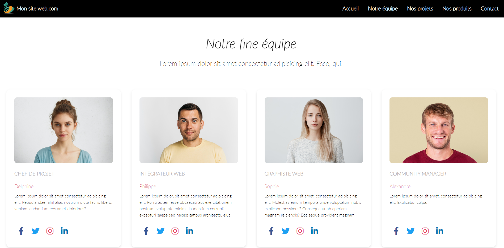
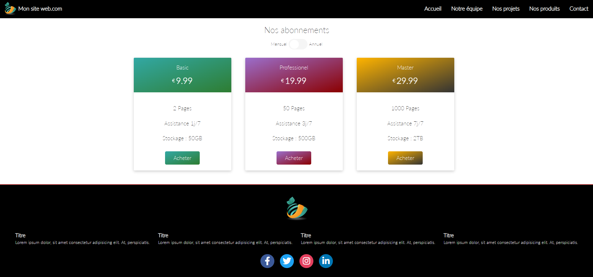
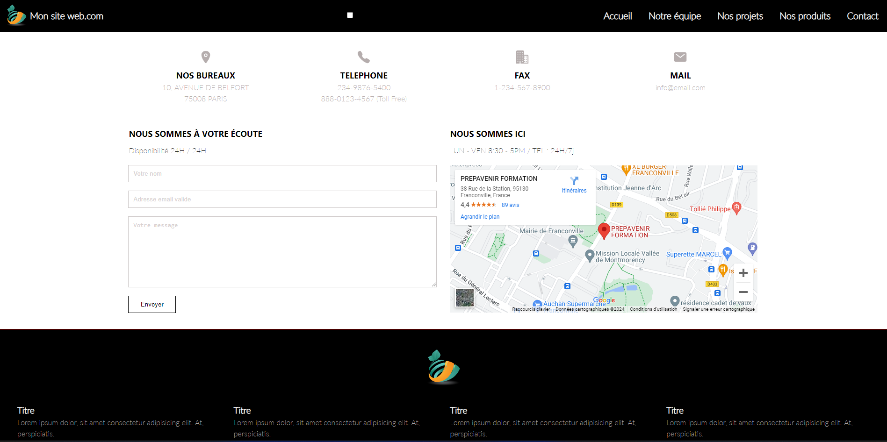

Site interactif entièrement réalisé avec html, css et javascript 
pour le TP d'une formation de développeur Web chez Prepavenir (95)
Merci à Jean-Damien Toulouse, notre formateur !

Quelques screenshots de l'appli:

